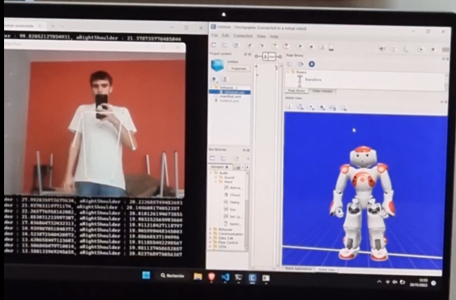

# Pose-robotics-project
 
If you want to move a robot's body without having one, you may find this repo useful !

In this repository, you will find a Python implementation to make a robot's arms move in function of a human's body movement. 
This script is using the emulator embedded in the software Choregraph.

This project is open-source so you can fork it or improve it as you wish.

</img>
 
</img>